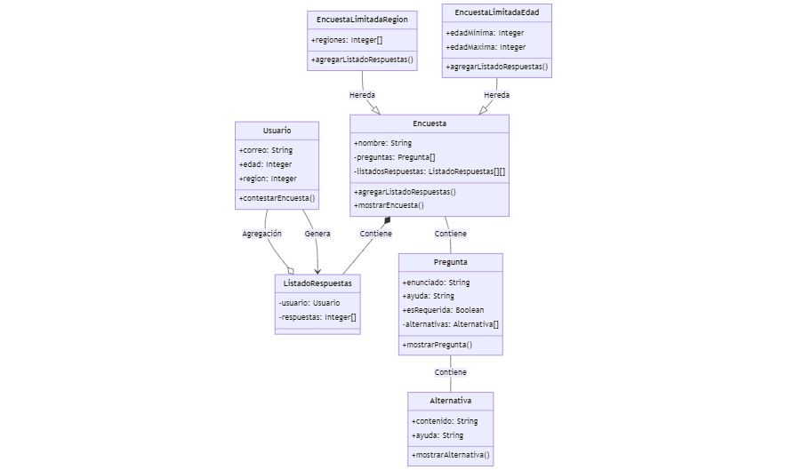

# Encuestas / diagramas de clases

Como consultor se me ha encomendado desarrollar un software que permita crear y contestar encuestas. Donde se solicita diagramar, y programar en base a ello, las relaciones existentes entre usuarios, encuestas, preguntas,
alternativas y respuestas.

Se crea el siguiente diagrama de clases en base a lo indicado por el cliente:



## alternativas.py

Este archivo tiene un contenido y una ayuda las cuales se pueden modificar libremente y Una alternativa solo puede existir como parte de una pregunta.

## pregunta.py

En este archivo se agrega un enunciado y una ayuda, una indicación de si es requerida y una lista de alternativas. Todas estas características se pueden consultar y modificar libremente, excepto las alternativas. Una pregunta solo puede existir como parte de una encuesta.

## encuesta.py

## Prerrequisitos o Dependencias

Sistema Operativo Windows, Linux, MacOS
Lenguaje de programación Python 3.12

## Instalación del Proyecto

Clonar el repositorio:

```bash
# git@github.com:vanemn/desafio_modulo4_clase9.git
```

Ingresar a la carpeta del proyecto:

```bash
# desafio_modulo4_clase9
```

Autor

- [Vanessa Morales](https://github.com/vanemn)
- [Benjamín Pardo](https://github.com/bpardo02)
- [Nicole Pinilla](https://github.com/Npinilla19)
