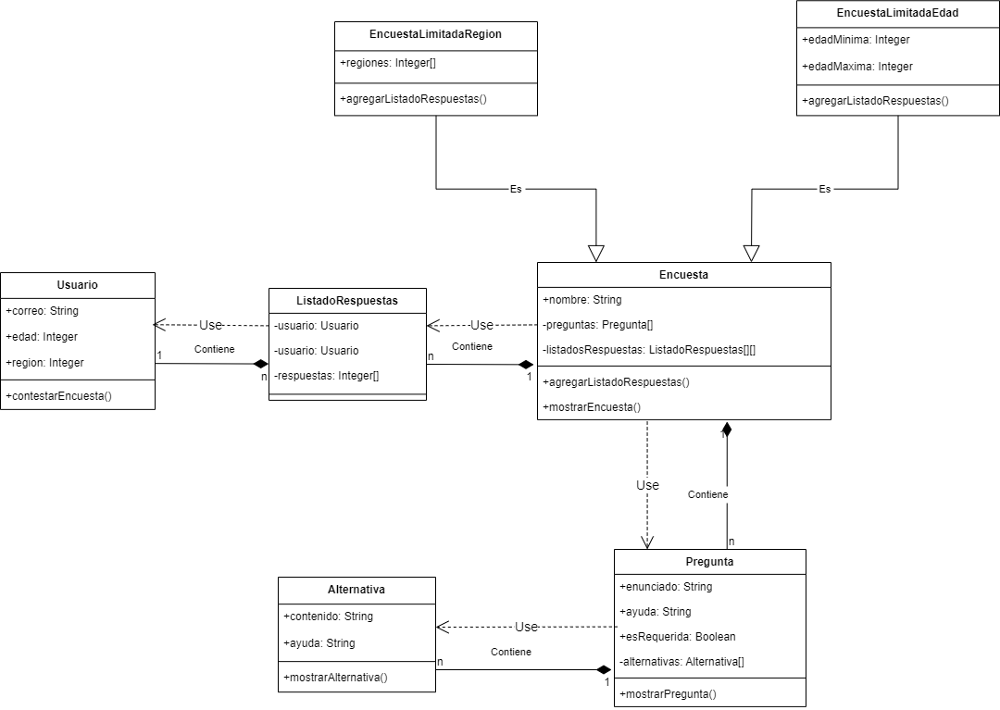

# Encuestas / diagramas de clases

Como consultor se me ha encomendado desarrollar un software que permita crear y contestar encuestas. Donde se solicita diagramar, y programar en base a ello, las relaciones existentes entre usuarios, encuestas, preguntas,
alternativas y respuestas.

Se crea el siguiente diagrama de clases en base a lo indicado por el cliente:



## alternativas.py

Este archivo tiene un contenido y una ayuda las cuales se pueden modificar libremente y Una alternativa solo puede existir como parte de una pregunta.

## pregunta.py

En este archivo se agrega un enunciado y una ayuda, una indicación de si es requerida y una lista de alternativas. Todas estas características se pueden consultar y modificar libremente, excepto las alternativas. Una pregunta solo puede existir como parte de una encuesta.

## encuesta.py

Este archivo encuesta tiene un nombre (texto), un listado de preguntas, y un listado de
listados de respuestas (inicialmente vacío, al crearse la encuesta). Solo el nombre puede consultarse y modificarse libremente. Cuenta con un mecanismo que permite mostrar la encuesta, donde se muestra tanto el nombre de la encuesta como sus preguntas.

Existen además dos tipos específicos de encuestas:

- Encuestas limitadas por edad: Además de la información contenida en cualquier encuesta, contienen una edad mínima (número entero) y una edad máxima (número entero)

- Encuestas limitadas por región: Además de la información contenida en cualquier encuesta, contienen una lista de regiones (lista de
  números enteros)

## listado_respuestas.py

El archivo contiene un listado de respuestas tiene una lista de respuestas (lista con números enteros). Tanto el usuario como las respuestas no se pueden modificar libremente. Un listado de respuestas sólo puede existir como parte de una encuesta.

## usuario.py

Este archivo contiene un correo (texto), edad (número entero) y región (número entero). Todos estos datos requieren de reglas para ser modificados. Cuenta con un mecanismo para contestar una encuesta, para lo cual
hace uso de una encuesta y de su mecanismo para agregar un listado de
respuestas a su lista de listados de respuestas.

## Prerrequisitos o Dependencias

Sistema Operativo Windows, Linux, MacOS
Lenguaje de programación Python 3.12

## Instalación del Proyecto

Clonar el repositorio:

```bash
# git@github.com:vanemn/desafio_modulo4_clase9.git
```

Ingresar a la carpeta del proyecto:

```bash
# desafio_modulo4_clase9
```

Autor

- [Vanessa Morales](https://github.com/vanemn)
- [Benjamín Pardo](https://github.com/bpardo02)
- [Nicole Pinilla](https://github.com/Npinilla19)
